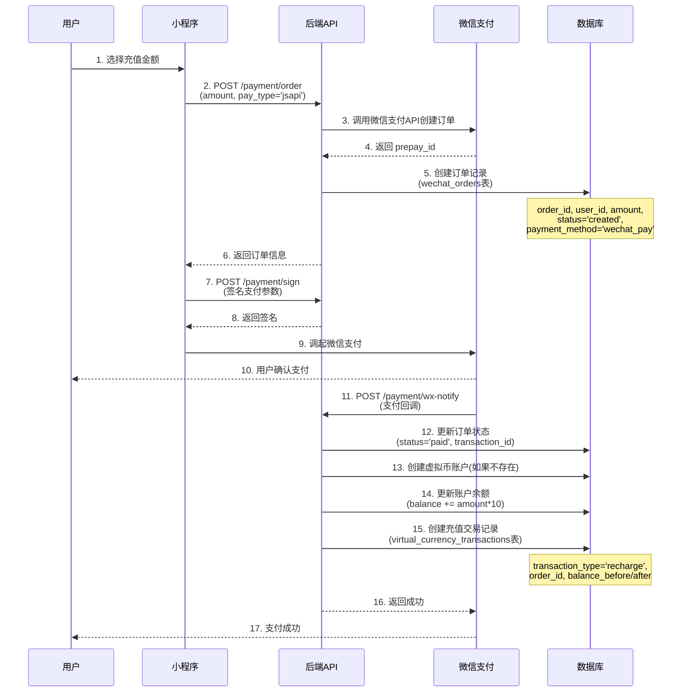
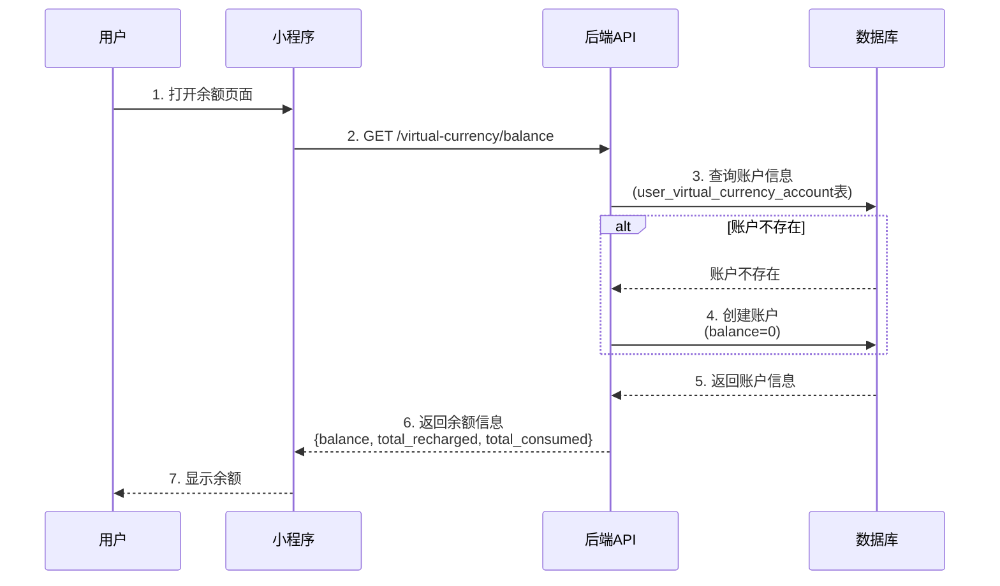
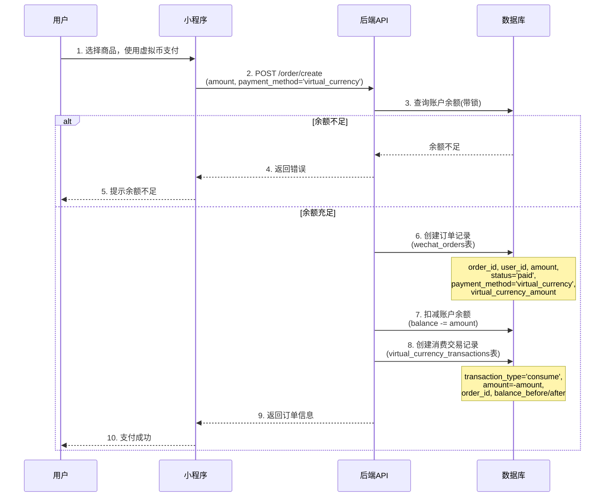
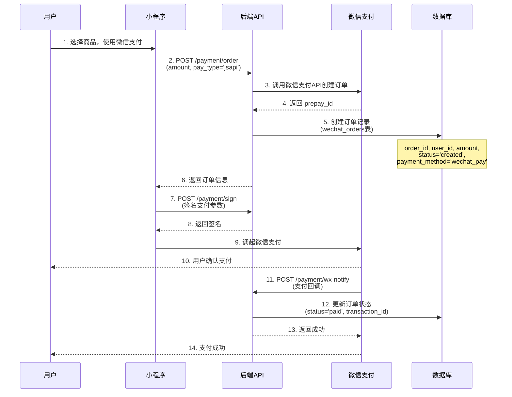

# 支付流程图和流程解析

## 1. 用户微信支付购买虚拟币

### 流程图



### 流程解析

**步骤说明：**

1. **创建订单阶段（步骤2-6）**
   - 用户选择充值金额（如100元）
   - 后端调用微信支付API创建订单
   - 在 `wechat_orders` 表中创建订单记录：
     ```sql
     INSERT INTO wechat_orders (
         order_id, user_id, amount, currency, 
         status, payment_method, pay_type
     ) VALUES (
         'order_xxx', 'user_123', 10000, 'CNY',
         'created', 'wechat_pay', 'jsapi'
     )
     ```

2. **支付阶段（步骤7-10）**
   - 小程序获取支付参数并签名
   - 调起微信支付，用户确认支付

3. **支付回调处理（步骤11-16）**
   - 微信支付回调通知后端
   - 更新订单状态为 `paid`，记录微信交易号
   - **关键操作：充值虚拟币**
     - 计算虚拟币：100元 × 10 = 1000代币
     - 更新账户余额：
       ```sql
       UPDATE user_virtual_currency_account 
       SET balance = balance + 1000,
           total_recharged = total_recharged + 10000
       WHERE user_id = 'user_123'
       ```
     - 创建交易记录：
       ```sql
       INSERT INTO virtual_currency_transactions (
           user_id, transaction_type, amount,
           balance_before, balance_after, order_id, status
       ) VALUES (
           'user_123', 'recharge', 1000,
           0, 1000, 'order_xxx', 'success'
       )
       ```

**数据存储：**
- `wechat_orders`: 1条记录（订单信息）
- `user_virtual_currency_account`: 1条记录（账户余额更新）
- `virtual_currency_transactions`: 1条记录（充值交易流水）

---

## 2. 查看用户虚拟币余额

### 流程图



### 流程解析

**步骤说明：**

1. **查询账户（步骤2-5）**
   - 查询 `user_virtual_currency_account` 表
   - 如果账户不存在，自动创建（余额为0）

2. **返回数据（步骤6-7）**
   - 返回当前余额、累计充值、累计消费等信息

**数据查询：**
```sql
SELECT balance, frozen_balance, total_recharged, total_consumed
FROM user_virtual_currency_account
WHERE user_id = 'user_123' AND deleted_at IS NULL
```

**数据存储：**
- 只读操作，不修改数据
- 如果账户不存在，会创建一条新记录（balance=0）

---

## 3. 用户使用虚拟币购买商品

### 流程图



### 流程解析

**步骤说明：**

1. **创建订单（步骤2-6）**
   - 用户选择商品，使用虚拟币支付
   - 后端创建订单，支付方式为 `virtual_currency`
   - 在 `wechat_orders` 表中创建订单：
     ```sql
     INSERT INTO wechat_orders (
         order_id, user_id, amount, currency,
         status, payment_method, virtual_currency_amount
     ) VALUES (
         'order_yyy', 'user_123', 5000, 'CNY',
         'paid', 'virtual_currency', 500
     )
     ```
   - 注意：订单状态直接为 `paid`（虚拟币支付无需等待回调）

2. **扣减虚拟币（步骤7-8）**
   - 使用数据库锁确保并发安全
   - 检查余额是否充足
   - 扣减账户余额：
     ```sql
     UPDATE user_virtual_currency_account 
     SET balance = balance - 500,
         total_consumed = total_consumed + 500
     WHERE user_id = 'user_123' AND balance >= 500
     ```
   - 创建消费交易记录：
     ```sql
     INSERT INTO virtual_currency_transactions (
         user_id, transaction_type, amount,
         balance_before, balance_after, order_id, status
     ) VALUES (
         'user_123', 'consume', -500,
         1000, 500, 'order_yyy', 'success'
     )
     ```

**数据存储：**
- `wechat_orders`: 1条记录（订单信息，status='paid'）
- `user_virtual_currency_account`: 余额更新（balance减少）
- `virtual_currency_transactions`: 1条记录（消费交易流水）

**关键点：**
- 使用数据库锁（`with_for_update()`）保证并发安全
- 余额检查在数据库层面进行，防止超扣
- 订单状态直接为 `paid`，无需等待支付回调

---

## 4. 用户使用微信支付购买商品

### 流程图



### 流程解析

**步骤说明：**

1. **创建订单阶段（步骤2-6）**
   - 用户选择商品，使用微信支付
   - 后端调用微信支付API创建订单
   - 在 `wechat_orders` 表中创建订单记录：
     ```sql
     INSERT INTO wechat_orders (
         order_id, user_id, amount, currency,
         status, payment_method, pay_type
     ) VALUES (
         'order_zzz', 'user_123', 5000, 'CNY',
         'created', 'wechat_pay', 'jsapi'
     )
     ```

2. **支付阶段（步骤7-10）**
   - 小程序获取支付参数并签名
   - 调起微信支付，用户确认支付

3. **支付回调处理（步骤11-13）**
   - 微信支付回调通知后端
   - 更新订单状态为 `paid`，记录微信交易号：
     ```sql
     UPDATE wechat_orders 
     SET status = 'paid',
         transaction_id = 'wx_transaction_xxx'
     WHERE order_id = 'order_zzz'
     ```

**数据存储：**
- `wechat_orders`: 1条记录（订单信息，status从'created'更新为'paid'）
- **注意**：微信支付购买商品不会产生虚拟币交易记录，因为这是直接支付，不是充值

**关键点：**
- 订单状态初始为 `created`，支付成功后更新为 `paid`
- 不涉及虚拟币账户操作
- 只有订单记录，没有虚拟币交易记录

---

## 数据表关系总结

### 表之间的关系

```
wechat_orders (订单表)
├─ 记录所有订单（充值订单、商品订单）
├─ payment_method: 'wechat_pay' | 'virtual_currency'
└─ order_id 作为关联键

virtual_currency_transactions (虚拟币交易记录表)
├─ 记录所有虚拟币账户变动
├─ transaction_type: 'recharge' | 'consume' | 'refund' | ...
└─ order_id: 关联订单号（如果是订单相关的交易）

user_virtual_currency_account (虚拟币账户表)
├─ 记录用户虚拟币余额
└─ 通过 user_id 关联用户
```

### 数据流转示例

**场景1：充值100元**
```
wechat_orders: 
  order_id='order_001', amount=10000, payment_method='wechat_pay', status='paid'

user_virtual_currency_account:
  balance=1000, total_recharged=10000

virtual_currency_transactions:
  transaction_type='recharge', amount=1000, order_id='order_001'
```

**场景2：用500代币购买商品**
```
wechat_orders:
  order_id='order_002', amount=5000, payment_method='virtual_currency', 
  virtual_currency_amount=500, status='paid'

user_virtual_currency_account:
  balance=500 (从1000减少到500), total_consumed=500

virtual_currency_transactions:
  transaction_type='consume', amount=-500, order_id='order_002'
```

**场景3：用微信支付购买商品**
```
wechat_orders:
  order_id='order_003', amount=5000, payment_method='wechat_pay', status='paid'

user_virtual_currency_account:
  无变化

virtual_currency_transactions:
  无记录（不涉及虚拟币）
```

